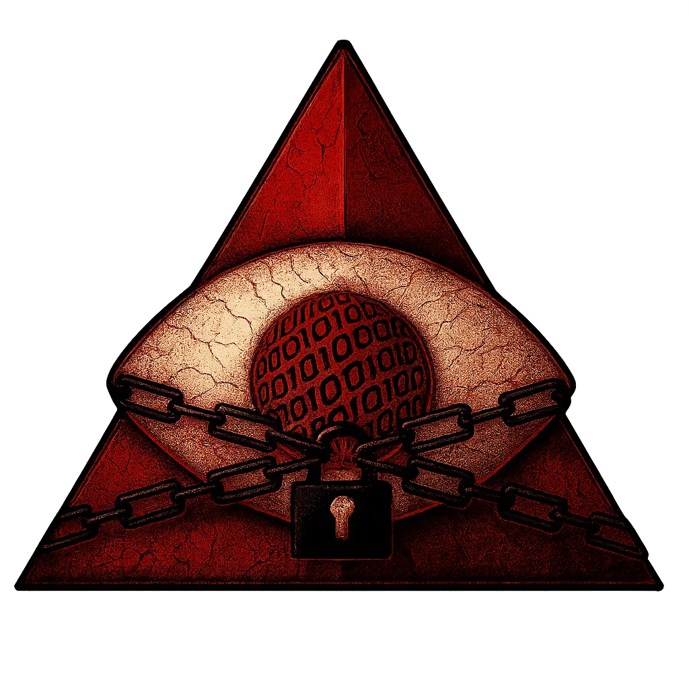

<div align="center">

# SecuroServ

</div>

<div align="center">
  
  <p><strong>A hybrid post-quantum end-to-end encryption implementation using Securo:
  </br>Ephemeral X25519 + Kyber-1024 key exchange, XSalsa20-Poly1305 AEAD encryption, Ed25519 signatures, Certificate (TLS 1.3) pinning (SPKI based), replay protection.</strong></p>
</div>

## Quick start
Build the server and client locally (Certificate pinning enabled in client):

```bash
# Fedora
sudo dnf install -y sqlite-devel openssl

# Build server
cd securoserv
cargo build --release
bash ./scripts/gen-pinned-cert.sh
USE_TLS=true ./target/release/securoserv

# Build client
cd securoclient
cargo build --release
./target/release/securoclient
```

## [Security Architecture](./docs/SECURITY_ARCHITECTURE.md)

</br>

## [Authentication Architecture](./docs/AUTHENTICATION_ARCHITECTURE.md)
