# Securoserv Authentication & Communication Flow

## Complete Cryptographic Protocol Overview

## Stage 1: Server Initiates Key Exchange (GET Request)

---

## Stage 2: Client Responds with Encrypted Keys (POST Request)

```mermaid
sequenceDiagram
    participant Client as 🔐 CLIENT
    participant Server as 🖥️ SERVER
    
    Note over Client: Client receives Stage 1 response
    Client->>Client: ✓ Base64URL decode all fields
    Client->>Client: ✓ Verify server_ephemeral_public is 32 bytes
    Client->>Client: ✓ Verify signature format (64 bytes)
    
    Note over Client: Verify server identity
    Client->>Client: ✓ Ed25519_verify(signature, server_verifying_key || server_ephemeral_public)
    Client->>Client: ✓ If verification fails: ABORT (server impersonation detected)
    Client->>Client: Store server_verifying_key for future response verification
    
    Note over Client: Prepare Stage 2 request
    Client->>Client: Create payload with client keys:<br/>  {<br/>    client_verifying_key: Ed25519_verify_pub,<br/>    client_kyber_public: Kyber_public<br/>  }
    Client->>Client: Encrypt with server's ephemeral key:<br/>  - Use server_ephemeral_public from stage1<br/>  - Use client's static secret key<br/>  - Create SalsaBox(server_eph_pub, client_static_secret)<br/>  - Generate random nonce (24 bytes)<br/>  - ciphertext = XSalsa20Poly1305_encrypt(payload, nonce)
    
    Client->>Server: POST /api/exchange/stage2<br/>ExchangeStage2Request {<br/>  stage_token: token_from_stage1,<br/>  client_public_key_b64: client_static_pub,<br/>  nonce: nonce_b64,<br/>  ciphertext: ciphertext_b64<br/>}
    
    Note over Server: Server validates Stage 2 request
    Server->>Server: ✓ Retrieve PendingExchange using stage_token
    Server->>Server: ✓ If not found: REJECT (session fixation attack detected)
    Server->>Server: ✓ Extract stored ephemeral_secret from Stage 1
    
    Note over Server: Decrypt client keys
    Server->>Server: ✓ Nonce length must be 24 bytes
    Server->>Server: Create SalsaBox using ephemeral_secret:<br/>  - Use client_public_key_b64 sent in request<br/>  - Use stored ephemeral_secret from stage1<br/>  - SalsaBox(client_static_pub, server_eph_secret)<br/>  - plaintext = XSalsa20Poly1305_decrypt(ciphertext, nonce)
    
    Note over Server: Verify client keys match binding
    Server->>Server: ✓ Extract client_verifying_key from plaintext
    Server->>Server: ✓ Extract client_kyber_public from plaintext
    Server->>Server: ✓ Store these for future request verification
    
    Note over Server: Create session & tokens
    Server->>Server: session_uuid = UUID v4 (unique per client)
    Server->>Server: temp_jwt = HMAC-SHA256_sign({<br/>  sub: session_uuid,<br/>  exp: now + 600s,<br/>  iat: now,<br/>  token_type: stage<br/>})
    Server->>Server: Create response payload:<br/>  {<br/>    temp_jwt: temp_jwt<br/>  }
    
    Note over Server: Encrypt Stage 2 response
    Server->>Server: response_nonce = random[24]
    Server->>Server: response_ciphertext = XSalsa20Poly1305_encrypt(response_payload, nonce)
    
    Server->>Client: ExchangeStage2Response {<br/>  nonce: response_nonce_b64,<br/>  ciphertext: response_ciphertext_b64<br/>}
    
    Note left of Client: Decrypt Stage 2 response
    Client->>Client: ✓ Nonce length validation (24 bytes)
    Client->>Client: response_plaintext = XSalsa20Poly1305_decrypt(ciphertext, nonce)
    Client->>Client: Extract temp_jwt from response
    Client->>Client: Store temp_jwt & server_verifying_key for auth phase
    Client->>Client: ✅ Key exchange complete, ready for authentication
```

---

## Phase 2: Authentication (Encrypted with Shared Secret)

```mermaid
sequenceDiagram
    participant Client as 🔐 CLIENT
    participant Server as 🖥️ SERVER
    
    Note over Client: Prepare authentication request
    Client->>Client: Have: session_uuid (from temp_jwt), HYBRID_SECRET
    Client->>Client: payload = {<br/>  license_key: "user_provided_license"<br/>}
    Client->>Client: auth_message = {<br/>  payload: payload,<br/>  session_id: temp_jwt<br/>}
    Client->>Client: request_nonce = random[24]
    Client->>Client: request_ciphertext = XSalsa20Poly1305_encrypt(auth_message, HYBRID_SECRET, nonce)
    
    Client->>Server: POST /api/auth<br/>EncryptedRequest {<br/>  nonce: request_nonce_b64,<br/>  ciphertext: request_ciphertext_b64,<br/>  timestamp: now_unix<br/>}
    
    Note over Server: Server decrypts & validates auth request
    Server->>Server: ✓ Validate timestamp (±60 seconds) - replay protection
    Server->>Server: ✓ Validate nonce length (24 bytes)
    Server->>Server: request_plaintext = XSalsa20Poly1305_decrypt(ciphertext, HYBRID_SECRET, nonce)
    Server->>Server: ✓ Extract temp_jwt from session_id field
    Server->>Server: ✓ Decode & validate JWT:<br/>  - Verify HMAC-SHA256 signature<br/>  - Check expiration (not past now)<br/>  - Verify token_type = "stage"<br/>  - Extract session_uuid from sub
    Server->>Server: ✓ Extract license_key from payload
    
    Note over Server: Validate license
    Server->>Server: ✓ Check license_key exists in database
    Server->>Server: ✓ Check license not expired
    Server->>Server: ✓ Check license not revoked/banned
    Server->>Server: ✓ Check client UUID not banned
    
    Note over Server: Issue permanent tokens
    Server->>Server: access_token = HMAC-SHA256_sign({<br/>  sub: session_uuid,<br/>  exp: now + 900s (15 min),<br/>  iat: now,<br/>  token_type: "access"<br/>})
    Server->>Server: refresh_token = HMAC-SHA256_sign({<br/>  sub: session_uuid,<br/>  exp: now + 604800s (7 days),<br/>  iat: now,<br/>  token_type: "refresh"<br/>})
    Server->>Server: Update session state:<br/>  - Replace stage_token with access_token<br/>  - Store refresh_token<br/>  - Store license_key<br/>  - Keep HYBRID_SECRET for encryption
    
    Note over Server: Encrypt authentication response
    Server->>Server: auth_response = {<br/>  access_token: access_token,<br/>  refresh_token: refresh_token,<br/>  token_type: "Bearer",<br/>  expires_in: 900<br/>}
    Server->>Server: response_nonce = random[24]
    Server->>Server: response_ciphertext = XSalsa20Poly1305_encrypt(auth_response, HYBRID_SECRET, response_nonce)
    Server->>Server: response_signature = Ed25519_sign(response_nonce_b64 || response_ciphertext_b64, server_signing_key)
    
    Server->>Client: EncryptedResponse {<br/>  nonce: response_nonce_b64,<br/>  ciphertext: response_ciphertext_b64,<br/>  signature: response_signature_b64,<br/>  timestamp: now_unix<br/>}
    
    Note over Client: Decrypt & store authentication response
    Client->>Client: ✓ Validate timestamp (±60 seconds)
    Client->>Client: ✓ Verify Ed25519 signature using server_verifying_key
    Client->>Client: ✓ Validate signature format (64 bytes)
    Client->>Client: response_plaintext = XSalsa20Poly1305_decrypt(ciphertext, HYBRID_SECRET, response_nonce)
    Client->>Client: Extract access_token & refresh_token
    Client->>Client: Store both tokens securely (memory/keyring)
    Client->>Client: Store session_uuid for future requests
    Client->>Client: ✅ Authentication successful!<br/>Ready for encrypted operations with access_token
```

---

## Logout/Unauthentication Flow

